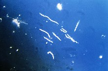

```{r loading libraries, echo=T, include=F}
library(rentrez)
library(ggplot2)
library(dplyr)
library(knitr)
```

##Importing an Image of Bacteria

I used the function include_graphics from the knitr package to easily import the photograph I saved from the internet of Borrelia burgdorferi. I used the fig.cap function to make sure there was a figure caption beneath the photo as well.

```{r importing photo, echo=T, fig.cap="Borrelia burgdorferi"}


```

##Adding a Link to Borrelia Burgdorferi

I did this using a super simple function of putting square brackets around the in line text I wanted you to see and click on ("Click HERE to...etc.") and then round brackets beside it that contains the link I want you to be re-directed to.

[Click HERE to go to the Borrelia Burgorferi Wiki Page](https://en.wikipedia.org/wiki/Borrelia_burgdorferi)


##Importing Sequences.csv File

We are going to use read.csv to import the dataset Sequences.csv we created in the "Download.R" R Script.

```{r importing dataset, echo=T}
SeqData = read.csv("Data/Sequences.csv")
```

##Printing Each Sequence on its Own

I used the as.character function to print out each individual sequence below.
```{r printing each sequence, echo=T}
print(as.character(SeqData$Sequence[1]))
print(as.character(SeqData$Sequence[2]))
print(as.character(SeqData$Sequence[3]))
```


##Counting the Number of Each Base Pair per Sequence

I first used the select function to get rid of the Name and X columns in my dataset, so there wouldn't be any interference with the letters in the Name column. Then, for each letter I replaced every letter except the one I was looking at with nothing (so just removing all but one letter from each sequence) using gsub. From there, I used the nchar() function to count how many characters were left after removing all other letters. What is left is a count of how many of my chosen letter there is in each sequence. From there I just copied and pasted my own code and substituted the letters so I was looking for a new letter each time.


####Selecting for T
```{r counting T, echo=T}
Selected = select(SeqData,-Name,-X)

OnlyT = gsub("[AGC]","", as.matrix(Selected))
OnlyNucleotideT = print(nchar(OnlyT, type="chars"))
```

####Selecting for A
```{r counting A, echo = T}
OnlyA = gsub("[TGC]","", as.matrix(Selected))
OnlyNucleotideA= print(nchar(OnlyA, type="chars"))
```

####Selecting for G
```{r selecting for G, echo=T}
OnlyG = gsub("[TAC]","", as.matrix(Selected))
OnlyNucleotideG = print(nchar(OnlyG, type="chars"))
```

####Selecting for C
```{r selecting for C, echo=T}
OnlyC = gsub("[TAG]","", as.matrix(Selected))
OnlyNucleotideC= print(nchar(OnlyC, type="chars"))
```

##Adding a Table that Shows the Number of Each Nucleotide for Each Sequence

I first made a new object that is a simple dataframe with just the Sequence IDs of each sequence I am looking at. I then made a table using the transmute() function, and included my new Sequence ID object, and all of the individual letter counts I just finished doing. To change the column names to something that looks nice, I used kable in knitr to then use the col.names function to rename the columns so it looks prettier.

```{r table building, echo=T}
SequenceID = c("HQ433692.1", "HQ433694.1", "HQ433691.1")
SequenceID = unlist(SequenceID)

NucleotideTable = transmute(SeqData,SequenceID,OnlyNucleotideC, OnlyNucleotideA, OnlyNucleotideG, OnlyNucleotideT)
knitr::kable(NucleotideTable, 
             col.names = c("Sequence ID",
                           "#C Nucleotides",
                           "#A Nucleotides",
                           "#G Nucleotides",
                           "#T Nucleotides"))

```

##Making a Table with GC Content

First, I made a new table that takes my existing table above (NucleotideTable) and adds a column called "GCContent" that calculates percentage of GC content by using this formula (where each letter represents # of that nucleotide present in each sequence: $$((G+C)/(G+C+A+T))*100$$

Then I made a new table called "NiceGCTable" which only used the columns for Sequence ID and this Calculated GC Content. Finally, I used the col.names function to make the column names prettier.

```{r calculating GC content and making a final table for it, echo=T}

GCTable = mutate(NucleotideTable,GCContent=((OnlyNucleotideG + OnlyNucleotideC)/(OnlyNucleotideA + OnlyNucleotideC + OnlyNucleotideG + OnlyNucleotideT))*100)

NiceGCTable = select(GCTable, SequenceID, GCContent)
knitr::kable(NiceGCTable, 
             col.names = c("Sequence ID",
                           "% of GC Content"))

```

##Importing the New GC_Content.csv File

```{r new file, echo=T}
NewFile = read.csv("Data/GC_content.csv")
```

##Calculating %GC Content in New File

Since the % of C and G have already been individually calculated, this is a simple function to figure out the %GC content since it's just: $$G+C$$

```{r adding new column of %GC content, echo=T}
FinalTable = mutate(NewFile, GCContent = (NewFile$G + NewFile$C))
head(FinalTable)
```

##Making Nice Scatterplot with %GC Content

```{r}
qplot(x=FinalTable$ID, y=FinalTable$GCContent, data=FinalTable, colour = FinalTable$Species,
      xlab="Species ID", ylab="%GC Content", main="%GC Content for Species A, B & C") +theme_classic() +labs(colour="Species")
```


